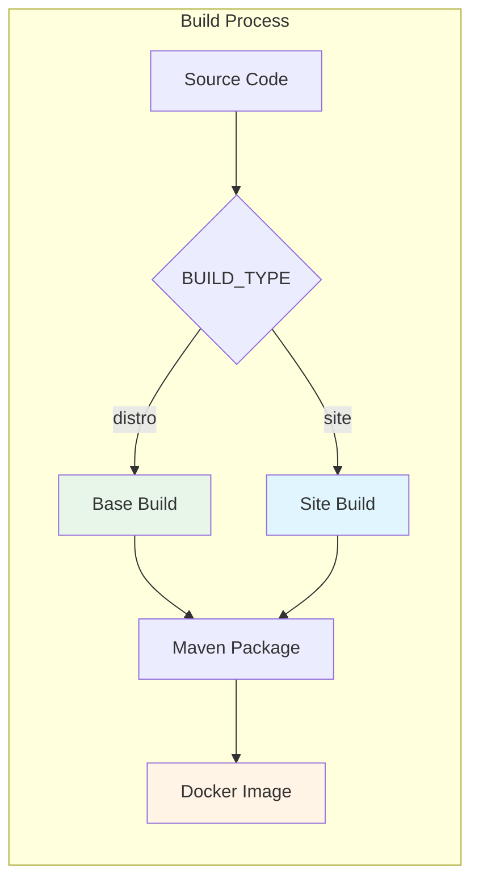

# Build Process

How PATH DRC EMR Docker images are built.

---

## Overview

PATH DRC EMR uses a multi-stage Docker build process to create optimized images. The build supports two modes:

1. **Base Distribution**: Standard distribution with common configuration
2. **Site-Specific**: Distribution with site-specific metadata and configuration



---

## Multi-Stage Dockerfile

The Dockerfile uses Docker multi-stage builds for efficiency:

### Stage 1: Shared Base

```dockerfile
FROM openmrs/openmrs-core:2.7.x-dev-amazoncorretto-17 AS base
WORKDIR /openmrs_distro
```

Both build types start from the same OpenMRS development image with Maven and JDK.

### Stage 2a: Base Distribution (distro_dev)

```dockerfile
FROM base AS distro_dev

COPY pom.xml ./
COPY distro distro

RUN mvn -s /usr/share/maven/ref/settings-docker.xml -U -P distro install
```

Builds using the `distro/` directory containing base configuration.

### Stage 2b: Site-Specific (site_dev)

```dockerfile
FROM base AS site_dev

COPY pom.xml .
COPY sites/$MVN_PROJECT sites/$MVN_PROJECT

RUN mvn -s /usr/share/maven/ref/settings-docker.xml -U -P $MVN_PROJECT install
```

Builds using a specific site directory (e.g., `sites/akram/` or `sites/libikisi/`).

### Stage 3: Runtime

```dockerfile
FROM openmrs/openmrs-core:2.7.x-amazoncorretto-17

COPY --from=dev /openmrs/distribution/openmrs_core/openmrs.war /openmrs/distribution/openmrs_core/
COPY --from=dev /openmrs/distribution/openmrs-distro.properties /openmrs/distribution/
COPY --from=dev /openmrs/distribution/openmrs_modules /openmrs/distribution/openmrs_modules
COPY --from=dev /openmrs/distribution/openmrs_owas /openmrs/distribution/openmrs_owas
COPY --from=dev /openmrs/distribution/openmrs_config /openmrs/distribution/openmrs_config
```

The final runtime image is smaller, containing only the built artifacts.

---

## Build Arguments

| Argument | Description | Default | Values |
|----------|-------------|---------|--------|
| `BUILD_TYPE` | Type of build | `distro` | `distro`, `site` |
| `MVN_PROJECT` | Maven project/profile | `distro` | `distro`, `akram`, `libikisi`, etc. |
| `MVN_ARGS` | Maven arguments | `install` | `install`, `deploy` |

---

## Building Locally

### Base Distribution

```bash
# Build all images (base distribution)
docker compose build

# Or with explicit arguments
docker compose build --build-arg BUILD_TYPE=distro
```

### Site-Specific Distribution

```bash
# Build for Libikisi site
TAG=latest-libikisi docker compose build \
  --build-arg BUILD_TYPE=site \
  --build-arg MVN_PROJECT=libikisi

# Build for Akram site
TAG=latest-akram docker compose build \
  --build-arg BUILD_TYPE=site \
  --build-arg MVN_PROJECT=akram
```

### Build Output

The build creates these artifacts:
- `openmrs.war` - OpenMRS backend WAR file
- `openmrs-distro.properties` - Distribution properties
- `openmrs_modules/` - Backend modules (OMOD files)
- `openmrs_owas/` - Open Web Apps
- `openmrs_config/` - Initializer configuration

---

## Maven Configuration

### Project Structure

```
path-drc-emr/
├── pom.xml                 # Root POM with profiles
├── distro/
│   ├── pom.xml            # Base distro POM
│   └── distro.properties  # Base distro properties
└── sites/
    ├── akram/
    │   ├── pom.xml        # Akram site POM
    │   └── distro.properties
    └── libikisi/
        ├── pom.xml        # Libikisi site POM
        └── distro.properties
```

### Maven Profiles

The root `pom.xml` defines profiles for each build target:

- `distro` - Base distribution
- `akram` - Akram site-specific
- `libikisi` - Libikisi site-specific

### GitHub Packages Authentication

Building locally requires Maven authentication for GitHub Packages:

Create/edit `~/.m2/settings.xml`:

```xml
<settings>
  <servers>
    <server>
      <id>github</id>
      <username>YOUR_GITHUB_USERNAME</username>
      <password>YOUR_GITHUB_TOKEN</password>
    </server>
  </servers>
</settings>
```

For Docker builds, mount settings as a secret:

```bash
docker compose build \
  --secret id=m2settings,src=$HOME/.m2/settings.xml
```

---

## CI/CD Pipeline

GitHub Actions automates the build process:

### Triggers

- **Push to main**: Builds and publishes `latest` tags
- **Tags**: Builds and publishes versioned images
- **Pull Requests**: Builds without publishing
- **Manual dispatch**: On-demand builds

### Multi-Platform Builds

Images are built for multiple architectures:
- `linux/amd64` (x86_64)
- `linux/arm64` (ARM64/Apple Silicon)

### Build Matrix

The CI builds:
1. Base distribution (`latest`)
2. Each site-specific distribution (`latest-akram`, `latest-libikisi`)

### Air-Gapped Bundles

For offline installations, the CI creates downloadable image bundles:
- `path-drc-emr-images-bundle.tgz` - All images for offline loading

---

## Adding a New Site

To add a new site-specific build:

1. **Create site directory:**
   ```bash
   mkdir -p sites/newsite
   ```

2. **Create `sites/newsite/pom.xml`:**
   ```xml
   <project>
     <parent>
       <groupId>org.path.drc</groupId>
       <artifactId>path-drc-emr</artifactId>
       <version>1.0.0-SNAPSHOT</version>
       <relativePath>../../pom.xml</relativePath>
     </parent>
     <artifactId>newsite</artifactId>
     <!-- ... -->
   </project>
   ```

3. **Create `sites/newsite/distro.properties`:**
   Define modules, OWAs, and configuration.

4. **Add profile to root `pom.xml`:**
   ```xml
   <profile>
     <id>newsite</id>
     <modules>
       <module>sites/newsite</module>
     </modules>
   </profile>
   ```

5. **Update CI workflow** to include the new site.

6. **Build and test:**
   ```bash
   TAG=latest-newsite docker compose build \
     --build-arg BUILD_TYPE=site \
     --build-arg MVN_PROJECT=newsite
   ```

See [Adding Sites](../administration/adding-sites) for detailed instructions.

---

## Troubleshooting

### Build Fails with Maven Errors

1. Check Maven settings for GitHub authentication
2. Verify network access to Maven Central and GitHub Packages
3. Check for dependency conflicts in `pom.xml`

### Out of Memory During Build

Increase Docker memory allocation or add to build command:
```bash
docker compose build --memory 4g
```

### Build Hangs

- Check network connectivity
- Try `--no-cache` to force fresh build
- Check Docker disk space

### Wrong Architecture

Ensure you're building for the correct platform:
```bash
docker compose build --platform linux/amd64
```

---

## Related

- [Docker Images](docker-images) - Image details
- [Adding Sites](../administration/adding-sites) - Creating new sites
- [CI/CD](../development/ci-cd) - Automated builds
