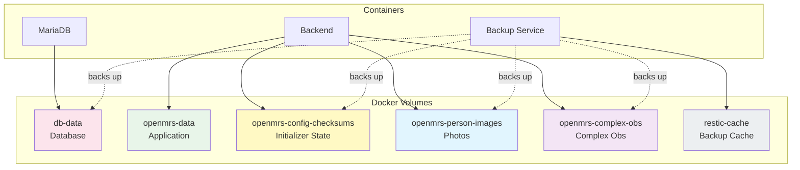
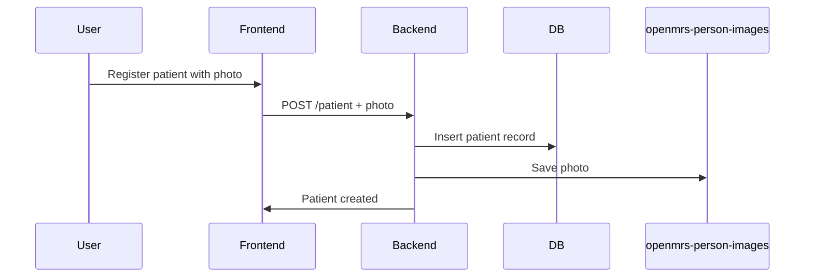
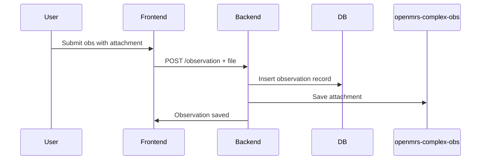

# Data Model

Data persistence, volumes, and storage in PATH DRC EMR.

---

## Overview

PATH DRC EMR uses Docker volumes to persist data across container restarts and upgrades. All important data is stored in named volumes that can be backed up and restored.



---

## Docker Volumes

### Core Volumes

| Volume | Container | Mount Point | Purpose |
|--------|-----------|-------------|---------|
| `db-data` | db | `/var/lib/mysql` | MariaDB database files |
| `openmrs-data` | backend | `/openmrs/data` | OpenMRS application data |

### Additional Volumes

| Volume | Container | Mount Point | Purpose |
|--------|-----------|-------------|---------|
| `openmrs-config-checksums` | backend | `/openmrs/data/configuration_checksums` | Initializer processing state |
| `openmrs-person-images` | backend | `/openmrs/data/person_images` | Patient/person photos |
| `openmrs-complex-obs` | backend | `/openmrs/data/complex_obs` | Complex observation attachments |
| `restic-cache` | backup | `/cache` | Restic backup cache |

---

## Volume Details

### db-data (Database)

Contains all MariaDB database files:
- Table data
- Indexes
- Transaction logs
- Binary logs (if enabled)

**Size Considerations:**
- Initial: ~500 MB
- Growth: Depends on patient volume and encounter complexity
- Typical: 1-10 GB for small to medium facilities

**Backup Priority:** Critical - backs up via MariaDB dump

### openmrs-data (Application Data)

General OpenMRS application data directory. Contains logs, temporary files, and runtime data.

**Backup Priority:** Medium - some data is recreatable

### openmrs-config-checksums (Initializer State)

Tracks which Initializer configurations have been processed. This prevents re-applying configurations on restart.

**Contents:**
- Checksum files for processed configurations
- State tracking for Initializer module

**Backup Priority:** High - losing this causes config reprocessing

### openmrs-person-images (Patient Photos)

Stores patient and provider photos uploaded through the system.

**Structure:**
```
person_images/
├── <person_uuid>/
│   └── image.jpg
└── ...
```

**Backup Priority:** High - not recreatable

### openmrs-complex-obs (Complex Observations)

Stores file attachments for complex observations (documents, images, etc.).

**Structure:**
```
complex_obs/
├── <obs_uuid>/
│   └── <filename>
└── ...
```

**Backup Priority:** High - clinical data

### restic-cache (Backup Cache)

Restic's local cache for faster backup operations. Not backed up as it's recreatable.

**Backup Priority:** None - recreatable

---

## Volume Configuration

Volumes can be customized using environment variables:

```bash
# Use custom paths instead of Docker volumes
OPENMRS_CONFIG_CHECKSUMS_PATH=/mnt/data/checksums
OPENMRS_PERSON_IMAGES_PATH=/mnt/data/person_images
OPENMRS_COMPLEX_OBS_PATH=/mnt/data/complex_obs
```

---

## Backup Integration

Volumes are labeled for the backup service:

```yaml
backend:
  labels:
    restic-compose-backup.volumes: true
    restic-compose-backup.volumes.include: "openmrs-config-checksums,openmrs-person-images,openmrs-complex-obs"

db:
  labels:
    restic-compose-backup.mariadb: true
```

### What Gets Backed Up

| Data | Method | Included |
|------|--------|----------|
| Database | MariaDB dump | Yes |
| Config checksums | Volume snapshot | Yes |
| Person images | Volume snapshot | Yes |
| Complex obs | Volume snapshot | Yes |
| Restic cache | - | No |
| Container logs | - | No |

---

## Data Flow

### Patient Registration



### Observation with Attachment



---

## Storage Recommendations

### Development/Testing

- Docker managed volumes are sufficient
- ~20 GB disk space

### Production

- Consider external storage for volumes
- SSD recommended for database
- Plan for growth (estimate 100 MB/patient/year)
- Implement backup to off-site storage

### High Availability

- Consider replicated storage (GlusterFS, NFS, cloud volumes)
- Database replication for read scaling
- Shared storage for stateless backend scaling

---

## Volume Management

### List Volumes

```bash
docker volume ls | grep path-drc
```

### Inspect Volume

```bash
docker volume inspect path-drc-emr_db-data
```

### Volume Size

```bash
# Check volume size (approximate)
docker system df -v | grep path-drc
```

### Remove Volumes

{: .warning }
> **Caution**: Removing volumes deletes all data permanently!

```bash
# Remove all project volumes
docker compose down -v

# Remove specific volume
docker volume rm path-drc-emr_db-data
```

---

## Database Schema

The OpenMRS database schema is documented at:
- [OpenMRS Data Model](https://wiki.openmrs.org/display/docs/Data+Model)

Key tables:
- `patient` - Patient demographic info
- `person` - Person information (patients, providers, users)
- `encounter` - Clinical encounters
- `obs` - Observations/clinical data
- `concept` - Clinical concepts dictionary
- `location` - Facility locations
- `users` - User accounts

---

## Disaster Recovery

### Full Recovery Process

1. **Restore volumes from backup:**
   ```bash
   docker compose -f docker-compose.yml -f docker-compose-restore.yml up -d
   ```

2. **Verify data integrity:**
   ```bash
   docker compose exec db mysql -u root -p openmrs -e "SHOW TABLES;"
   ```

3. **Clean up restore container:**
   ```bash
   docker compose -f docker-compose.yml -f docker-compose-restore.yml rm restore
   ```

See [Backup & Restore](../operations/backup-restore) for detailed procedures.

---

## Related

- [Backup & Restore](../operations/backup-restore) - Backup procedures
- [Docker Images](docker-images) - Container details
