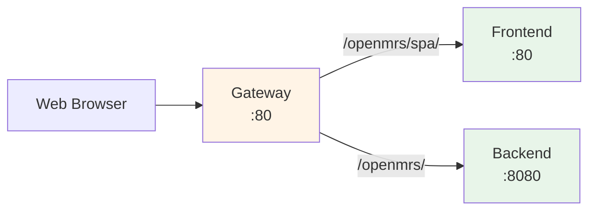

# Gateway

The gateway is the nginx reverse proxy that provides a unified entry point to PATH DRC EMR.

---

## Overview

The gateway sits in front of the frontend and backend containers, routing requests to the appropriate service based on URL path. This architecture solves CORS (Cross-Origin Resource Sharing) issues by presenting a single origin to web browsers.



---

## URL Routing

| Request Path | Destination | Description |
|--------------|-------------|-------------|
| `/` | Redirect to `/openmrs/spa/` | Default redirect to SPA |
| `/openmrs/spa` | Redirect to `/openmrs/spa/` | Ensure trailing slash |
| `/openmrs/spa/*` | Frontend container | OpenMRS 3.0 SPA |
| `/openmrs/*` | Backend container | OpenMRS REST API and Legacy UI |

---

## Security Headers

The gateway adds security headers to all responses:

### X-XSS-Protection
```
X-XSS-Protection: 1; mode=block
```
Enables browser XSS filtering.

### X-Content-Type-Options
```
X-Content-Type-Options: nosniff
```
Prevents MIME type sniffing.

### Content-Security-Policy

The CSP header varies by request path:

**Default (SPA)**:
```
default-src 'self' 'unsafe-inline' 'unsafe-eval' localhost localhost:*;
base-uri 'self';
font-src 'self';
img-src 'self' data:;
frame-ancestors 'self' ${FRAME_ANCESTORS};
```

**Legacy UI** (`/openmrs/admin/`, `/openmrs/dictionary/`, etc.):
```
default-src 'self' 'unsafe-inline';
script-src 'self' 'unsafe-inline' 'unsafe-eval';
base-uri 'self';
font-src 'self';
frame-ancestors 'self';
```

**OWA** (`/openmrs/owa`):
```
default-src 'self' 'unsafe-inline';
script-src 'self' 'unsafe-inline' 'unsafe-eval';
base-uri 'self';
font-src 'self' data:;
img-src 'self' data:;
frame-ancestors 'self';
```

---

## Configuration

### Environment Variables

| Variable | Description | Default |
|----------|-------------|---------|
| `FRAME_ANCESTORS` | Allowed domains for iframe embedding | `'self'` |

### Proxy Headers

The gateway sets these headers for upstream services:

| Header | Value |
|--------|-------|
| `HOST` | `$host` |
| `X-Forwarded-Proto` | Original protocol (http/https) |
| `X-Real-IP` | Original client IP |
| `X-Forwarded-For` | Proxy chain |

---

## Compression

The gateway enables gzip compression for better performance:

```nginx
gzip on;
gzip_vary on;
gzip_min_length 1024;
gzip_proxied any;
```

### Compressed Content Types

- `text/html`, `text/css`, `text/javascript`, `text/plain`, `text/xml`
- `application/json`, `application/javascript`, `application/xml`
- `application/fhir+json`, `application/fhir+xml`
- `font/eot`, `font/otf`, `font/ttf`
- `image/svg+xml`

---

## Upstream Configuration

### Frontend Upstream

```nginx
upstream frontend {
  server frontend max_fails=0;
}
```

Always assumes the frontend is available (no failure tracking).

### Backend Upstream

```nginx
upstream backend {
  server backend:8080 max_fails=0;
}
```

Always assumes the backend is available (no failure tracking).

---

## HTTPS Considerations

When serving via HTTPS (using a reverse proxy in front of the gateway):

1. The `X-Forwarded-Proto` header is used to detect the original protocol
2. Secure cookie flags can be enabled by uncommenting:
   ```nginx
   proxy_cookie_flags $var_proxy_cookie_flags;
   ```
   This sets `secure` and `samesite=strict` flags on the `JSESSIONID` cookie.

---

## Customization

### Embedding in iframes

To allow embedding in iframes from specific domains, set the `FRAME_ANCESTORS` environment variable:

```bash
FRAME_ANCESTORS="https://example.com https://another.com"
```

### Adding Custom Headers

To add custom headers, modify the gateway configuration in a custom build or use a reverse proxy in front of the gateway.

---

## Troubleshooting

### CORS Errors

If you see CORS errors in the browser console:
1. Verify all requests go through the gateway (not directly to backend)
2. Check that the frontend is using relative URLs (`/openmrs/` not `http://backend:8080/openmrs/`)
3. Verify the gateway is routing correctly

### 502 Bad Gateway

If you see 502 errors:
1. Check that the backend/frontend containers are running
2. Check backend logs: `docker compose logs backend`
3. Verify the services are healthy: `docker compose ps`

### Slow Responses

If responses are slow:
1. Check that gzip compression is working
2. Verify the backend isn't overloaded
3. Check database performance

---

## Related

- [Docker Images](docker-images) - Container image details
- [Architecture Overview](index) - System architecture
