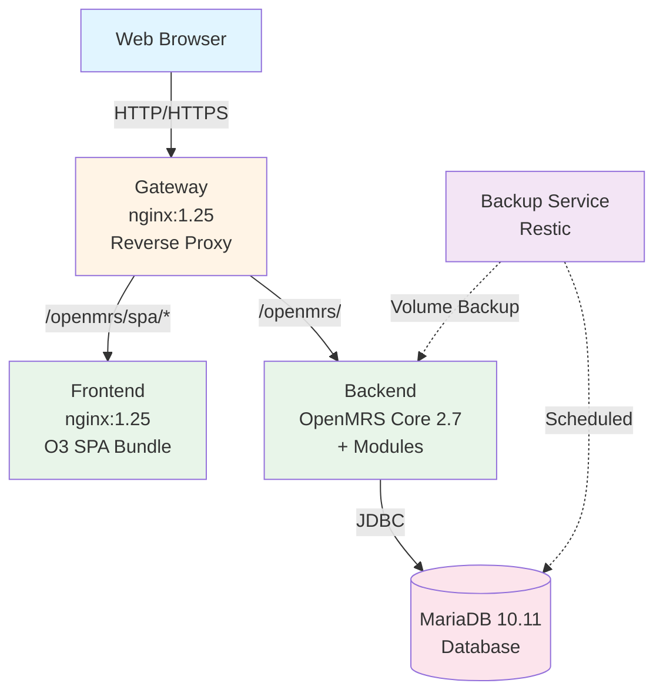
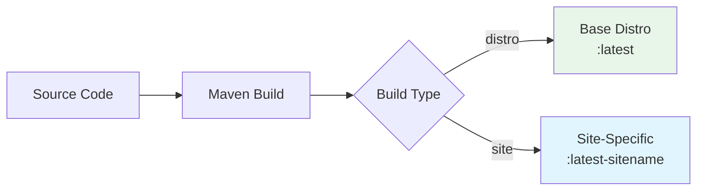

# Architecture

This section provides a comprehensive overview of PATH DRC EMR's technical architecture.

## System Overview

PATH DRC EMR is a containerized OpenMRS 3.0 distribution consisting of five main components orchestrated with Docker Compose.

---

## Components

### Gateway (nginx)
Reverse proxy routing requests to frontend or backend services. Handles CORS and provides a single entry point.

### Frontend (nginx + O3 SPA)
Serves the OpenMRS 3.0 Single Page Application with pre-built frontend modules.

### Backend (OpenMRS)
OpenMRS server providing the REST API, business logic, and data persistence.

### Database (MariaDB)
Persistent data storage for OpenMRS.

### Backup (Restic)
Automated backup service for data protection.

---

## What's in This Section

- **[Docker Images](docker-images)**: Details of each image
- **[Build Process](build-process)**: How images are built
- **[Gateway](gateway)**: Gateway configuration and routing
- **[Data Model](data-model)**: Data persistence and volumes

---

## Build Architecture

PATH DRC EMR supports two build types:

---

## Data Persistence

Docker volumes used for data persistence:

| Volume | Purpose | Backed Up |
|--------|---------|-----------|
| `db-data` | MariaDB database files | Yes |
| `openmrs-data` | OpenMRS application data | Yes |
| `openmrs-config-checksums` | Initializer state | Yes |
| `openmrs-person-images` | Patient photos | Yes |
| `openmrs-complex-obs` | Complex observation data | Yes |
| `restic-cache` | Backup cache | No |
