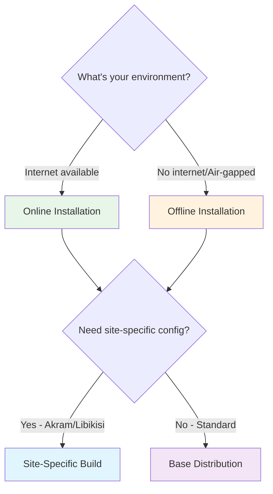

# Deployment

This section covers production deployment of PATH DRC EMR.

## Deployment Decision Tree

Choose your deployment approach based on your environment:

## Deployment Approaches

### Online Installation
{: .text-green-200}

Best for environments with reliable internet connectivity. Images are pulled directly from GitHub Container Registry.

**Pros:** Simple setup, automatic access to latest updates, smaller initial download

**Cons:** Requires internet during installation, requires GitHub authentication

[Online Installation Guide](online-installation)

### Offline Installation
{: .text-orange-200}

Best for air-gapped environments or locations with limited internet. Uses pre-packaged image bundles.

**Pros:** No internet required after bundle download, predictable installation

**Cons:** Larger initial file transfer, manual update process

[Offline Installation Guide](offline-installation)

### Site-Specific Builds
{: .text-blue-200}

Use pre-configured builds for specific facilities (Akram, Libikisi) with customized metadata.

[Site-Specific Guide](site-specific)

---

## What's in This Section

- **[Online Installation](online-installation)**: Step-by-step guide for internet-connected deployments
- **[Offline Installation](offline-installation)**: Air-gapped installation procedures
- **[Site-Specific Builds](site-specific)**: Using facility-specific configurations
- **[Environment Variables](environment-variables)**: Complete `.env` reference

---

## Comparison Table

| Feature | Online | Offline | Site-Specific |
|---------|--------|---------|---------------|
| Internet Required | During install | No | During install* |
| Setup Complexity | Low | Medium | Low-Medium |
| Customization | Full | Full | Pre-configured |
| Update Process | Simple | Manual | Simple |

*Offline bundles also available for site-specific builds
