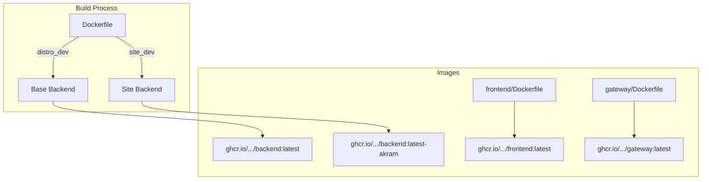

# Building Images

Guide to building Docker images for PATH DRC EMR.

---

## Overview

PATH DRC EMR consists of three custom Docker images:
- **backend** - OpenMRS server with modules and configuration
- **frontend** - OpenMRS 3.0 SPA frontend
- **gateway** - nginx reverse proxy

Plus standard images for:
- **db** - MariaDB database
- **backup** - Restic backup service

---

## Image Architecture



---

## Backend Image

### Multi-Stage Build

The backend Dockerfile uses multi-stage builds:

```dockerfile
# Base layer
FROM openmrs/openmrs-core:2.7.x-dev-amazoncorretto-17 AS base

# Distro build (base distribution)
FROM base AS distro_dev
# Builds the base distribution

# Site build (site-specific)
FROM base AS site_dev
# Builds site-specific distribution

# Select stage based on BUILD_TYPE
FROM ${BUILD_TYPE}_dev AS dev

# Runtime image
FROM openmrs/openmrs-core:2.7.x-amazoncorretto-17
COPY --from=dev /openmrs/distribution/ /openmrs/distribution/
```

### Build Arguments

| Argument | Description | Default |
|----------|-------------|---------|
| `BUILD_TYPE` | `distro` or `site` | `distro` |
| `MVN_PROJECT` | Site name for site builds | `distro` |
| `MVN_ARGS` | Maven arguments | `install` |

### Building Backend

**Base distribution:**
```bash
docker compose build backend
```

**Site-specific:**
```bash
docker compose build backend \
  --build-arg BUILD_TYPE=site \
  --build-arg MVN_PROJECT=akram
```

**With deployment:**
```bash
docker compose build backend \
  --build-arg MVN_ARGS=deploy
```

---

## Frontend Image

### Dockerfile

```dockerfile
FROM nginx:alpine

# Copy SPA configuration
COPY config/config.json /usr/share/nginx/html/

# Copy assets
COPY assets/ /usr/share/nginx/html/assets/
```

### Building Frontend

```bash
docker compose build frontend
```

### Site-Specific Frontend

Site-specific frontends use the same image but may have different configurations.

---

## Gateway Image

### Dockerfile

```dockerfile
FROM nginx:alpine

# Copy configuration template
COPY default.conf.template /etc/nginx/templates/
```

### Configuration Template

The gateway uses environment variable substitution:

```nginx
server {
    listen 80;

    location /openmrs {
        proxy_pass http://backend:8080;
    }

    location / {
        proxy_pass http://frontend:80;
    }
}
```

### Building Gateway

```bash
docker compose build gateway
```

---

## Local Build

### Build All Images

```bash
docker compose build
```

### Build Without Cache

```bash
docker compose build --no-cache
```

### Build Specific Service

```bash
docker compose build backend
docker compose build frontend
docker compose build gateway
```

### Build with BuildKit

BuildKit provides better caching and parallelism:

```bash
DOCKER_BUILDKIT=1 docker compose build
```

---

## CI/CD Build

### GitHub Actions Workflow

The `build-and-release.yml` workflow:

1. **Detects changes** - Uses paths-filter to detect what needs building
2. **Builds base** - Builds base distribution images
3. **Builds sites** - Builds site-specific images in parallel
4. **Pushes images** - Pushes to GitHub Container Registry
5. **Creates bundles** - Creates air-gapped installation bundles

### Image Tags

| Tag Format | Description | Example |
|------------|-------------|---------|
| `latest` | Latest base build | `backend:latest` |
| `latest-{site}` | Latest site build | `backend:latest-akram` |
| `{version}` | Version release | `backend:1.0.0` |
| `{sha}` | Git commit | `backend:abc1234` |

### Build Triggers

- **Push to main** - Builds and pushes all changed images
- **Tag push** - Creates release with version tags
- **Manual dispatch** - Builds all images

---

## Image Registry

### GitHub Container Registry

Images are hosted at:
```
ghcr.io/path-drc/path-drc-emr-backend
ghcr.io/path-drc/path-drc-emr-frontend
ghcr.io/path-drc/path-drc-emr-gateway
```

### Authentication

```bash
docker login ghcr.io -u USERNAME -p TOKEN
```

### Pulling Images

```bash
# Latest base
docker pull ghcr.io/path-drc/path-drc-emr-backend:latest

# Site-specific
docker pull ghcr.io/path-drc/path-drc-emr-backend:latest-akram

# Specific version
docker pull ghcr.io/path-drc/path-drc-emr-backend:1.0.0
```

---

## Air-Gapped Bundles

### Bundle Creation

The CI workflow creates air-gapped bundles using docker-compose-air-gapper:

```bash
# Generated files
path-drc-emr-images-bundle.tgz        # Base images
path-drc-emr-images-bundle-akram.tgz  # Akram site images
```

### Bundle Contents

Each bundle contains:
- Docker image tar files
- `load-images.sh` script
- Checksums

### Using Bundles

```bash
# Extract
tar -xzf path-drc-emr-images-bundle.tgz

# Load images
./load-images.sh
```

---

## Build Optimization

### Layer Caching

Use registry cache for faster builds:

```yaml
cache-to: |
  type=registry,ref=ghcr.io/.../backend:latest-cache
cache-from: |
  type=registry,ref=ghcr.io/.../backend:latest-cache
```

### Multi-Platform Builds

Build for multiple architectures:

```yaml
platforms: linux/amd64,linux/arm64
```

### BuildKit Secrets

Maven settings are passed securely:

```yaml
secret-files: |
  m2settings=/home/runner/.m2/settings.xml
```

---

## Troubleshooting

### Build Fails

**Check Maven settings:**
```bash
# Verify settings exist
cat ~/.m2/settings.xml

# Check GitHub token
mvn dependency:resolve -P distro
```

**Check Docker resources:**
```bash
docker system df
docker stats --no-stream
```

### Image Too Large

Reduce image size:
- Use multi-stage builds
- Remove unnecessary files
- Use slim base images

### Push Fails

**Check authentication:**
```bash
docker logout ghcr.io
docker login ghcr.io
```

**Check permissions:**
Ensure token has `write:packages` scope for pushing.

---

## Related

- [Build Process](../architecture/build-process) - Architecture details
- [CI/CD](ci-cd) - Automated builds
- [Local Development](local-development) - Development setup
