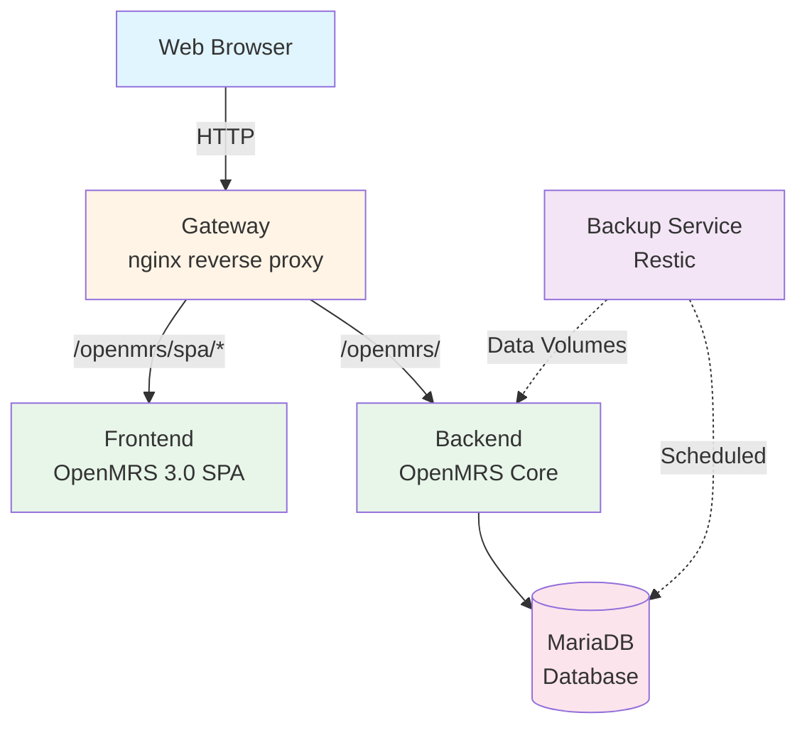

# PATH DRC EMR Documentation

Welcome to the documentation for PATH DRC EMR, an OpenMRS 3.0-based Electronic Medical Record system designed for PATH DRC healthcare facilities.

{: .fs-6 .fw-300 }

---

## What is PATH DRC EMR?

PATH DRC EMR is a containerized distribution of OpenMRS 3.0, configured specifically for healthcare facilities in the Democratic Republic of Congo. It provides a complete, ready-to-deploy EMR system with:

- Modern web-based interface (OpenMRS 3.0 SPA)
- Pre-configured metadata and workflows
- Site-specific customizations
- Automated backup capabilities
- Support for both online and offline deployments

## Quick Links by Role

Choose your path based on what you need to do:

### I want to **deploy** PATH DRC EMR
{: .text-blue-200}

Start here if you're setting up a new installation.

[Getting Started](getting-started/){: .btn .btn-primary .fs-5 .mb-4 .mb-md-0 .mr-2 }
[Online Installation](deployment/online-installation){: .btn .fs-5 .mb-4 .mb-md-0 .mr-2 }
[Offline Installation](deployment/offline-installation){: .btn .fs-5 .mb-4 .mb-md-0 }

### I want to **operate** an existing system
{: .text-green-200}

Manage day-to-day operations, backups, monitoring, and troubleshooting.

[Operations Guide](operations/){: .btn .btn-primary .fs-5 .mb-4 .mb-md-0 .mr-2 }
[Backup & Restore](operations/backup-restore){: .btn .fs-5 .mb-4 .mb-md-0 .mr-2 }
[User Management](operations/user-management){: .btn .fs-5 .mb-4 .mb-md-0 }

### I want to **customize** for my site
{: .text-purple-200}

Configure site-specific settings, add new locations, or manage metadata.

[Administration Guide](administration/){: .btn .btn-primary .fs-5 .mb-4 .mb-md-0 .mr-2 }
[Adding Sites](administration/adding-sites){: .btn .fs-5 .mb-4 .mb-md-0 .mr-2 }
[Metadata Management](administration/metadata-management){: .btn .fs-5 .mb-4 .mb-md-0 }

### I want to **contribute** to development
{: .text-yellow-200}

Build images locally, understand the architecture, or contribute code.

[Development Guide](development/){: .btn .btn-primary .fs-5 .mb-4 .mb-md-0 .mr-2 }
[Architecture](architecture/){: .btn .fs-5 .mb-4 .mb-md-0 .mr-2 }
[Contributing](development/contributing){: .btn .fs-5 .mb-4 .mb-md-0 }

---

## System Architecture

PATH DRC EMR consists of five main components:

**Components:**
- **Gateway**: Nginx reverse proxy handling routing and CORS
- **Frontend**: OpenMRS 3.0 Single Page Application
- **Backend**: OpenMRS server with modules and configuration
- **Database**: MariaDB for data persistence
- **Backup**: Automated backup service using Restic

[Learn more about the architecture](architecture/)

---

## Key Features

### Site-Specific Configurations
Deploy with pre-configured settings for specific facilities (e.g., Akram, Libikisi) or use the base distribution.

### Online and Offline Support
Install with internet connectivity or use pre-packaged bundles for air-gapped environments.

### Automated Backups
Built-in backup and restore capabilities with support for local and cloud storage backends.

### Modern Interface
OpenMRS 3.0 provides a fast, intuitive web interface optimized for clinical workflows.

---

## Related Resources

- **Source Code**: [path-drc/path-drc-emr](https://github.com/path-drc/path-drc-emr)
- **Content Package**: [openmrs-content-path-drc](https://github.com/path-drc/openmrs-content-path-drc)
- **OpenMRS Community**: [talk.openmrs.org](https://talk.openmrs.org)
- **OpenMRS Documentation**: [wiki.openmrs.org](https://wiki.openmrs.org)

---

## Need Help?

- **Documentation Issues**: [Report on GitHub](https://github.com/path-drc/path-drc-emr/issues)
- **Questions**: [OpenMRS Talk](https://talk.openmrs.org)
- **FAQ**: [Frequently Asked Questions](reference/faq)
