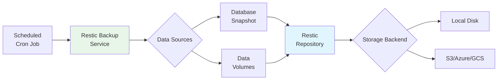

# Backup & Restore

Comprehensive guide to backing up and restoring PATH DRC EMR data.

---

## Overview

PATH DRC EMR includes built-in backup and restore functionality powered by [Restic](https://restic.readthedocs.io/), a modern backup tool that supports multiple storage backends and provides efficient, encrypted backups.

**What gets backed up:**
- MariaDB database
- OpenMRS application data
- Configuration checksums
- Person images
- Complex observations

---

## How Backup Works



The backup and restore are managed by dedicated Docker Compose services using the `mekomsolutions/restic-compose-backup` and `mekomsolutions/restic-compose-backup-restore` images.

---

## Configuration

### Environment Variables

Configure backup behavior in your `.env` file:

| Variable | Description | Example |
|----------|-------------|---------|
| `RESTIC_REPOSITORY` | Restic repository URL (local path, s3, etc.) | `/backup` |
| `RESTIC_PASSWORD` | Password for the Restic repository | `your-secure-password` |
| `RESTIC_KEEP_DAILY` | Number of daily snapshots to keep | `7` |
| `RESTIC_KEEP_WEEKLY` | Number of weekly snapshots to keep | `4` |
| `RESTIC_KEEP_MONTHLY` | Number of monthly snapshots to keep | `6` |
| `RESTIC_KEEP_YEARLY` | Number of yearly snapshots to keep | `2` |
| `LOG_LEVEL` | Log verbosity | `info` or `debug` |
| `CRON_SCHEDULE` | Cron schedule for automatic backups | `0 2 * * *` (daily at 2am) |
| `RESTIC_RESTORE_SNAPSHOT` | (Restore only) Snapshot ID or tag to restore | `latest` |
| `BACKUP_PATH` | Local directory for backup repository | `./backup` |

### Volumes and Labels

The `backend` and `db` services are labeled and configured to include their data volumes in the backup. Additional volumes (configuration checksums, person images, complex obs) are also included.

---

## Quick Start

### Enable Backups

Add to your `.env` file:

```bash
RESTIC_REPOSITORY=/backup
RESTIC_PASSWORD=your-secure-password
CRON_SCHEDULE=0 2 * * *
RESTIC_KEEP_DAILY=7
RESTIC_KEEP_WEEKLY=4
RESTIC_KEEP_MONTHLY=6
RESTIC_KEEP_YEARLY=2
```

Restart backup service:

```bash
docker compose restart backup
```

---

## Storage Backends

Restic supports multiple storage backends:

### Local Storage

```bash
RESTIC_REPOSITORY=/backup
BACKUP_PATH=./backup
```

### Amazon S3

```bash
RESTIC_REPOSITORY=s3:s3.amazonaws.com/your-bucket-name
AWS_ACCESS_KEY_ID=your-access-key
AWS_SECRET_ACCESS_KEY=your-secret-key
```

### Azure Blob Storage

```bash
RESTIC_REPOSITORY=azure:your-container:/
AZURE_ACCOUNT_NAME=your-account-name
AZURE_ACCOUNT_KEY=your-account-key
```

### Google Cloud Storage

```bash
RESTIC_REPOSITORY=gs:your-bucket-name:/
GOOGLE_PROJECT_ID=your-project-id
GOOGLE_APPLICATION_CREDENTIALS=/path/to/credentials.json
```

---

## Backup Operations

### Manual Backup

```bash
docker compose exec backup restic backup /data
```

### List Snapshots

```bash
docker compose exec backup restic snapshots
```

### Check Repository

```bash
docker compose exec backup restic check
```

---

## Restore Operations

To restore from a backup:

1. **Set environment variables** in `.env`:

   ```bash
   BACKUP_PATH=./backup
   RESTIC_PASSWORD=your-password
   RESTIC_RESTORE_SNAPSHOT=latest  # or specific snapshot ID
   ```

2. **Start the restore service:**

   ```bash
   docker compose -f docker-compose.yml -f docker-compose-restore.yml up -d
   ```

   This will restore the specified snapshot to the appropriate volumes. The `backend` and `db` services are configured to wait for the restore to complete before starting.

3. **Clean up after restore:**

   {: .warning }
   > **Important**: The restore process leaves a restore container that will block future backups. You must clean it up.

   ```bash
   docker compose -f docker-compose.yml -f docker-compose-restore.yml rm restore
   docker compose -f docker-compose.yml -f docker-compose-restore.yml exec backup restic unlock -v
   ```

---

## Best Practices

### Security

- Use a strong `RESTIC_PASSWORD`
- Store password securely (password manager)
- Keep password backup in a safe location
- Restic encrypts backups by default

### Reliability

- Test restore procedures regularly
- Consider off-site backups for disaster recovery
- Monitor backup logs for errors
- Run `restic check` periodically

### Storage Management

- Plan adequate storage space
- Monitor backup size growth over time
- Adjust retention policies as needed

---

## Troubleshooting

### Backup Fails to Start

Check backup service logs:

```bash
docker compose logs backup
```

### Repository Locked

If repository is locked after a failed operation:

```bash
docker compose exec backup restic unlock
```

### Restore Container Blocks Backup

Clean up after restore:

```bash
docker compose -f docker-compose.yml -f docker-compose-restore.yml rm restore
docker compose -f docker-compose.yml -f docker-compose-restore.yml exec backup restic unlock -v
```

---

## References

- [Restic Documentation](https://restic.readthedocs.io/en/stable/)
- [mekomsolutions/restic-compose-backup](https://hub.docker.com/r/mekomsolutions/restic-compose-backup)
